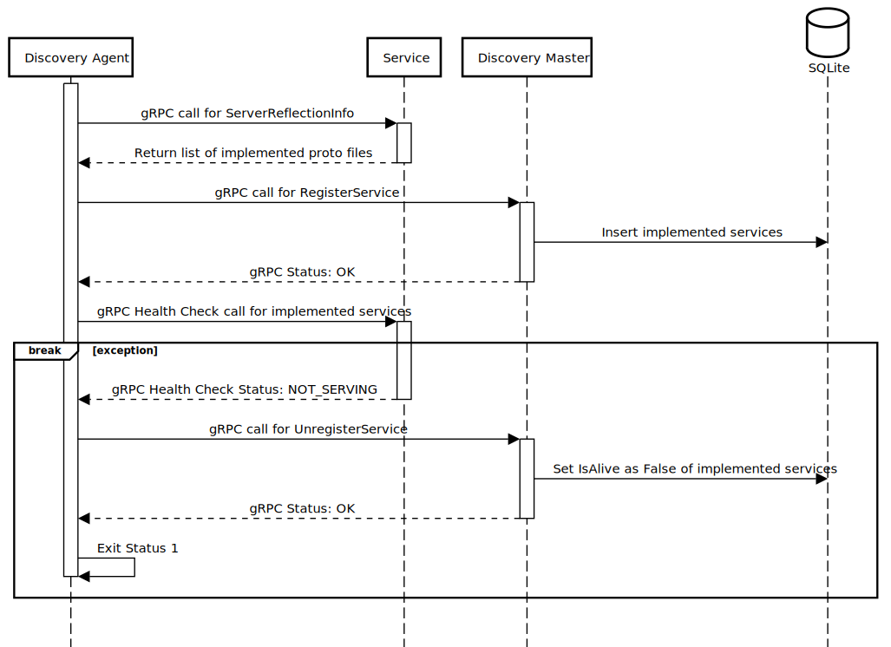

# gRPC Microservices
## Overview

Deployed to [Oketo](https://www.okteto.com/) -> [https://grpc-ui-gbauso.cloud.okteto.net](https://grpc-ui-gbauso.cloud.okteto.net/)

This project is a POC of the [API Composition Pattern](https://microservices.io/patterns/data/api-composition.html) but using gRPC, the idea is having the same proto file implemented in different services (micro or nano) and each service returns a piece of the information to the gateway.

### Gateway  

### Discovery Service  

## Stack

In order to prove this concept, a set of tools and languages were chosen:  

* Logging: Fluentd reads service log files and send it over to New Relic.
* Metrics: Prometheus exposes an endpoint in the service (will be migrated to New Relic).
* Discovery Service: Service written in GoLang and contains the implementation of Master(gRPC server) and Agent that invokes Reflection and HealthCheck on services and send it over to Master(register and unregister). Data Source: SQLite
* gRPC Gateway (aka City Information Service): gRPC server written in C# and contains the implementation of the gRPC composition and calls the Discovery Master and afterwards the involved services.
* Nearby Cities Service: Service written in Node (using TypeScript) and contains the implementation of [cityinformation.CityService](https://github.com/gbauso/contract/blob/master/cityinformation.proto#L17) plus [grpc.health.v1.Health](https://github.com/grpc/grpc/blob/master/src/proto/grpc/health/v1/health.proto) and [grpc.reflection.v1alpha.ServerReflection](https://github.com/grpc/grpc/blob/master/src/proto/grpc/reflection/v1alpha/reflection.proto). Data Source: [nearby-cities NPM Package](https://www.npmjs.com/package/nearby-cities)
* Population Service: gRPC server written in Python and contains the implementation of [cityinformation.CityService](https://github.com/gbauso/contract/blob/master/cityinformation.proto#L18) plus [grpc.health.v1.Health](https://github.com/grpc/grpc/blob/master/src/proto/grpc/health/v1/health.proto) and [grpc.reflection.v1alpha.ServerReflection](https://github.com/grpc/grpc/blob/master/src/proto/grpc/reflection/v1alpha/reflection.proto). Data Source: [OpenDataSoft](https://public.opendatasoft.com/explore/dataset/geonames-all-cities-with-a-population-1000/table/?disjunctive.cou_name_en&sort=name)
* Weather Service: gRPC server written in Kotlin and contains the implementation of [cityinformation.CityService](https://github.com/gbauso/contract/blob/master/cityinformation.proto#L19) plus [grpc.health.v1.Health](https://github.com/grpc/grpc/blob/master/src/proto/grpc/health/v1/health.proto) and [grpc.reflection.v1alpha.ServerReflection](https://github.com/grpc/grpc/blob/master/src/proto/grpc/reflection/v1alpha/reflection.proto). Data Source: [OpenWeather API](https://openweathermap.org/api)

## How to run

### Requirements

* Account in New Relic (Url and API Key needed)
* Open Weather API Key 

#### Docker Compose

Before run `docker-compose up`, it's necessary creating a `.env` file (copying from `.env.example`) and setting values:

* NR_BASE_URL -> New Relic logging base URL -> `e.g https://log-api.eu.newrelic.com/log/v1`
* NR_API_KEY -> New Relic API Key with permissions for logging
* OPENWEATHER_APP_ID -> Open Weather API KEY (APP ID)

After `run docker compose up` open GRPC-UI on [http(s)://localhost:8080](http(s)://localhost:8080) 

#### Okteto (K8S)

Before deploying to Okteto, you need to create some secrets (`go to Setting -> Secrets`):

* NR_BASE_URL -> New Relic logging base URL -> `e.g https://log-api.eu.newrelic.com/log/v1`
* NR_API_KEY -> New Relic API Key with permissions for logging
* OPENWEATHER_ID -> Open Weather API KEY (APP ID)

After deploy to okteto open open GRPC-UI on [https://grpc-ui-{yourOktetoUserOrNamespace}.cloud.okteto.net/](https://grpc-ui-{yourOktetoUserOrNamespace}.cloud.okteto.net/)

#### Kubernetes (With Istio)

##### Requisites

Kubectl configured, Helm Charts and Istio installed.

###### Windows

You can find a file called `run.ps1` and follow the example.

`e.g ./run.ps1 $OPENWEATHER_ID $NR_BASE_URL $NR_API_KEY $INSTALL_ISTIO_ADDONS`

* OPENWEATHER_ID -> Open Weather API KEY (APP ID)
* NR_BASE_URL -> New Relic logging base URL -> `e.g https://log-api.eu.newrelic.com/log/v1`
* NR_API_KEY -> New Relic API Key with permissions for logging
* INSTALL_ISTIO_ADDONS -> Install Jaeger, Prometheus, Grafana and Kiali -> Values: 0 or 1

###### Linux/Mac

You can find a file called `run.sh` and follow the example.

`e.g ./run.sh $OPENWEATHER_ID $NR_BASE_URL $NR_API_KEY $INSTALL_ISTIO_ADDONS`

* OPENWEATHER_ID -> Open Weather API KEY (APP ID)
* NR_BASE_URL -> New Relic logging base URL -> `e.g https://log-api.eu.newrelic.com/log/v1`
* NR_API_KEY -> New Relic API Key with permissions for logging
* INSTALL_ISTIO_ADDONS -> Install Jaeger, Prometheus, Grafana and Kiali -> Values: 0 or 1

After deploy to k8s open GRPC-UI on [http(s)://ui.{yourDomain}/](http(s)://ui.{yourDomain}/)

## Development

Want to contribute? Great!

Start development on this project is simple, fork the project and open it on VSCode or your preferred IDE. It will be a pleasure review your PR.

## Todos

 - [x] Finish configuration of Istio
 - [ ] Write Unit tests for the services
 - [ ] Unify the logs and improve readability
 - [ ] Move metrics from Prometheus to New Relic
 - [ ] Move from Azure Pipelines to Github Actions
 - [ ] Cover Server Stream, Client Stream and Bidirectional on Gateway
 - [ ] SSL on gRPC servers

License
----

MIT