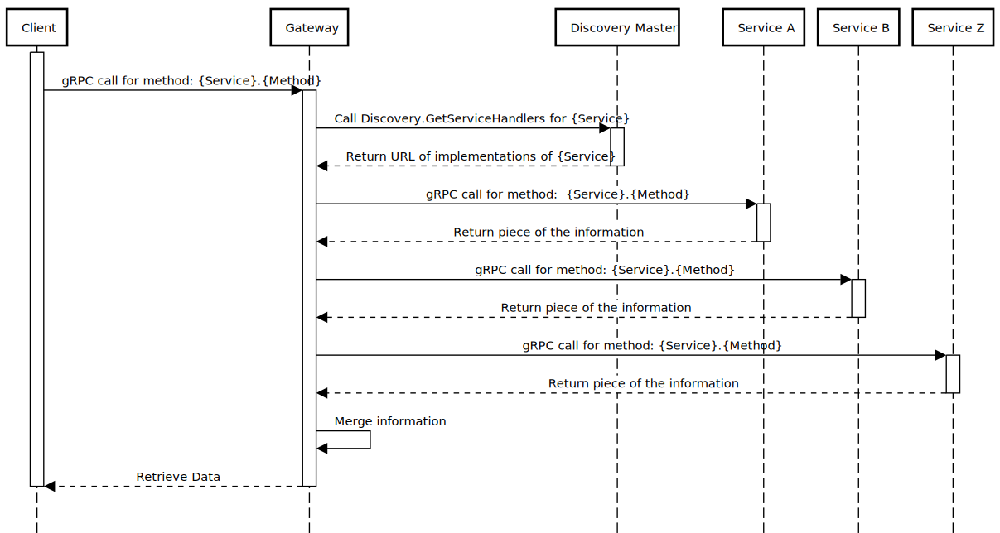

# gRPC Microservices
## Overview
This project is a POC of the [API Composition Pattern](https://microservices.io/patterns/data/api-composition.html) but using gRPC, the idea is having the same proto file implemented in different services (micro or nano) and each service returns a piece of the information to the gateway.

### Gateway  

### Discovery Service  

## Stack

In order to prove this concept, a set of tools and languages were chosen:  

* Logging: Fluentd reads service log files and send it over to New Relic.
* Metrics: Prometheus exposes an endpoint in the service (will be migrated to New Relic).
* Discovery Service: Service written in GoLang and contains the implementation of Master(gRPC server) and Agent that invokes Reflection and HealthCheck on services and send it over to Master(register and unregister). Data Source: SQLite
* gRPC Gateway (aka City Information Service): gRPC server written in C# and contains the implementation of the gRPC composition and calls the Discovery Master and afterwards the involved services.
* Nearby Cities Service: Service written in Node (using TypeScript) and contains the implementation of [cityinformation.CityService](https://github.com/gbauso/contract/blob/master/cityinformation.proto#L17) plus [grpc.health.v1.Health](https://github.com/grpc/grpc/blob/master/src/proto/grpc/health/v1/health.proto) and [grpc.reflection.v1alpha.ServerReflection](https://github.com/grpc/grpc/blob/master/src/proto/grpc/reflection/v1alpha/reflection.proto). Data Source: [nearby-cities NPM Package](https://www.npmjs.com/package/nearby-cities)
* Population Service: gRPC server written in Python and contains the implementation of [cityinformation.CityService](https://github.com/gbauso/contract/blob/master/cityinformation.proto#L18) plus [grpc.health.v1.Health](https://github.com/grpc/grpc/blob/master/src/proto/grpc/health/v1/health.proto) and [grpc.reflection.v1alpha.ServerReflection](https://github.com/grpc/grpc/blob/master/src/proto/grpc/reflection/v1alpha/reflection.proto). Data Source: [OpenDataSoft](https://public.opendatasoft.com/explore/dataset/geonames-all-cities-with-a-population-1000/table/?disjunctive.cou_name_en&sort=name)
* Weather Service: gRPC server written in Kotlin and contains the implementation of [cityinformation.CityService](https://github.com/gbauso/contract/blob/master/cityinformation.proto#L18) plus [grpc.health.v1.Health](https://github.com/grpc/grpc/blob/master/src/proto/grpc/health/v1/health.proto) and [grpc.reflection.v1alpha.ServerReflection](https://github.com/grpc/grpc/blob/master/src/proto/grpc/reflection/v1alpha/reflection.proto). Data Source: [OpenWeather API](https://openweathermap.org/api)

